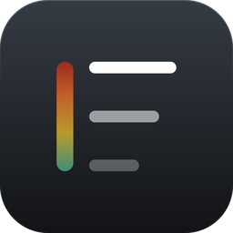
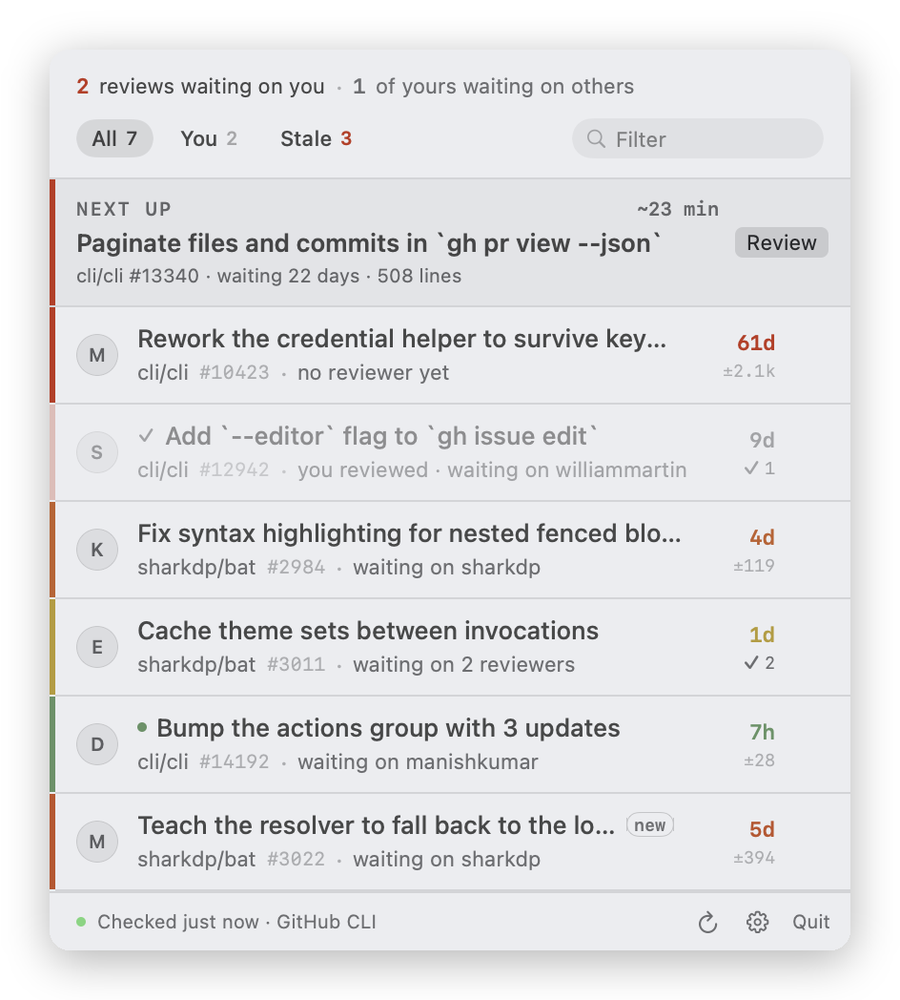
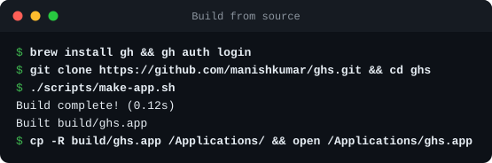
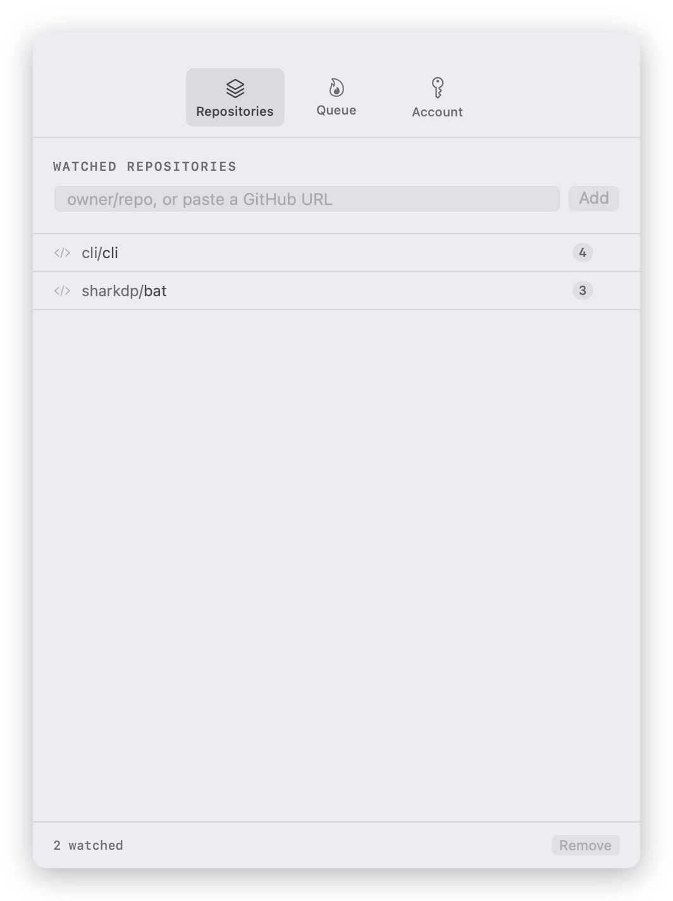
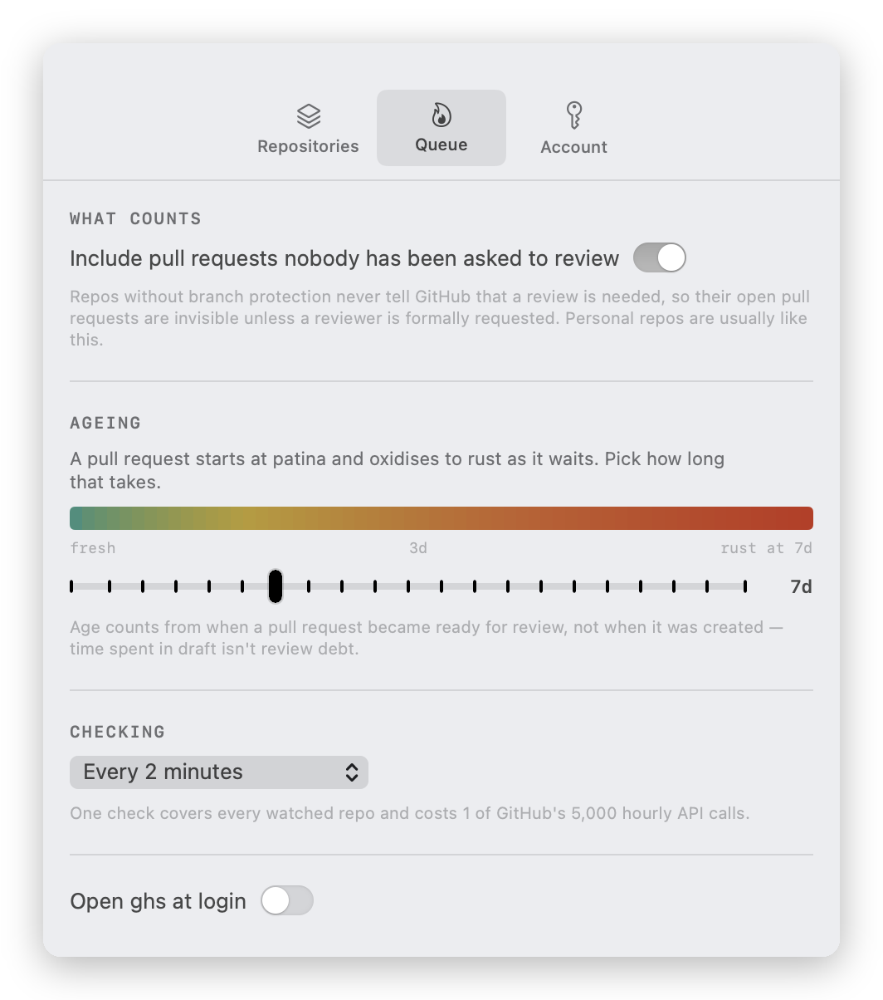
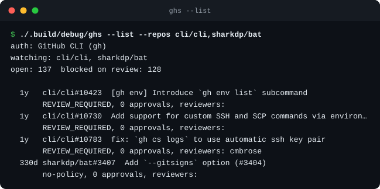
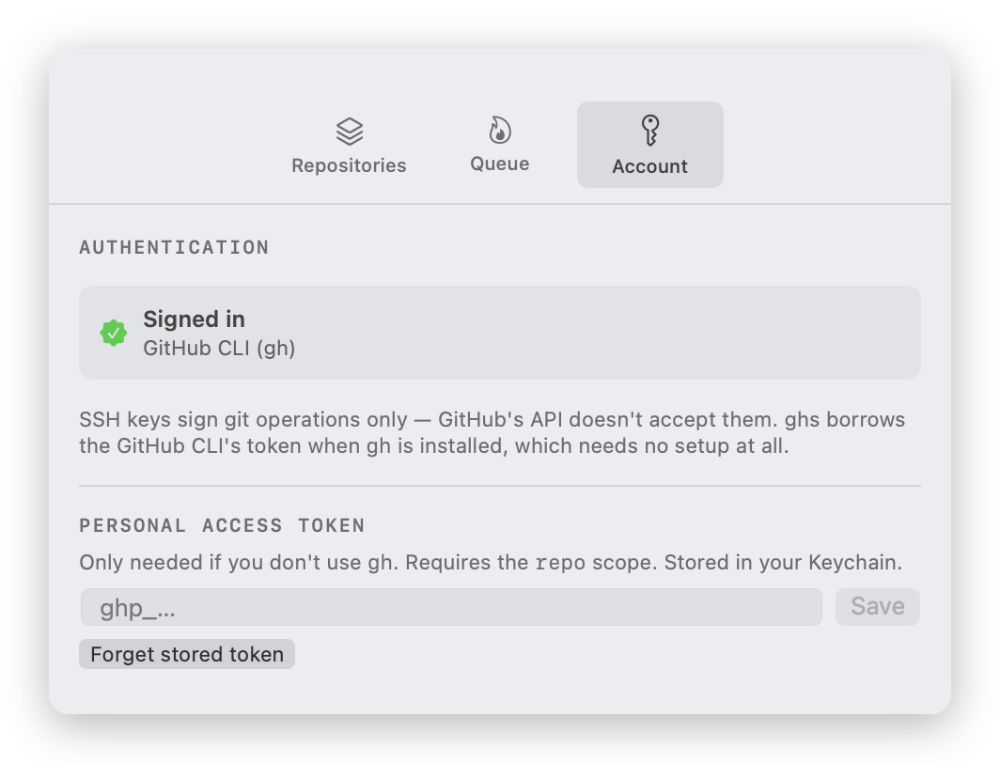
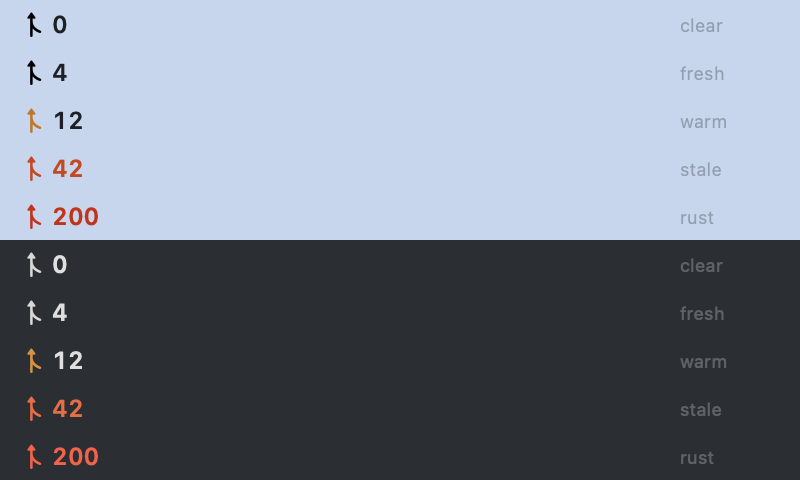

<p align="center">
  
</p>

<h1 align="center">ghs</h1>

<p align="center">
  A macOS status bar app that gets pull requests reviewed.<br>
  Not by listing them — by making it obvious who is holding whom up.
</p>

<p align="center">
  <picture>
    <source media="(prefers-color-scheme: dark)" srcset="docs/queue-dark.png">
    
  </picture>
</p>

---

## Getting started

### 1. Prerequisites

```sh
xcode-select --install               # Swift toolchain (no full Xcode needed)
brew install gh && gh auth login     # GitHub CLI, signed in
```

macOS 15 or later. **`gh` is doing real work here, not convenience**: an SSH key
signs git operations but GitHub's API rejects it outright, so ghs needs an API
token and borrows `gh`'s. If you'd rather not install `gh`, skip to
[Authentication](#authentication) and paste a personal access token instead.

### 2. Build and install

<p align="center">
  
</p>

```sh
git clone https://github.com/manishkumar/ghs.git && cd ghs
./scripts/make-app.sh                          # builds build/ghs.app
cp -R build/ghs.app /Applications/
open /Applications/ghs.app
```

A locally built app isn't quarantined, so there's no Gatekeeper prompt to click
through. The glyph appears in the status bar; there is no Dock icon and no app
switcher entry.

### 3. Add the repos you review for

Click the status bar item, then the gear — or press `⌘,`. Paste a GitHub URL or
type `owner/repo`, and press **Add**. The count beside each repo is how many of
its pull requests are currently blocked on review.

<p align="center">
  <picture>
    <source media="(prefers-color-scheme: dark)" srcset="docs/settings-repositories-dark.png">
    
  </picture>
</p>

Watching more repos costs nothing — one GraphQL search covers all of them.

### 4. Decide what counts, and how fast it ages

<p align="center">
  <picture>
    <source media="(prefers-color-scheme: dark)" srcset="docs/settings-queue-dark.png">
    
  </picture>
</p>

Two settings matter on day one:

- **Include pull requests nobody has been asked to review** — leave this on
  unless every repo you watch has branch protection. Without it, open PRs in
  unprotected repos never appear. See
  [what counts as waiting on review](#what-counts-as-waiting-on-review).
- **Ageing** — how many days until a pull request is drawn as rust. Seven suits
  a team that reviews within a day or two; raise it for a busy repo where a week
  is normal, or the whole list saturates and the colour stops meaning anything.

### 5. If the queue looks empty

Run the same data path from the terminal. It prints where the token came from,
which repos were searched, and what it made of each pull request — enough to
tell "not authenticated" from "nothing is actually blocked".

<p align="center">
  
</p>

```sh
./.build/debug/ghs --list                            # your configured repos
./.build/debug/ghs --list --repos cli/cli            # any repo, ignoring config
```

If it prints `not authenticated`, open **Settings → Account** to see which
source ghs found — and paste a token if you aren't using `gh`.

<p align="center">
  <picture>
    <source media="(prefers-color-scheme: dark)" srcset="docs/settings-account-dark.png">
    
  </picture>
</p>

## The idea

A shared backlog is the thing nobody acts on. "42 open reviews" is a weather
report; it takes about a week to become wallpaper. ghs is built around the
narrower question that actually moves people: **who is waiting on you, and how
long have they been waiting?**

**The status bar is one number.** How many pull requests are blocked on review,
in a glyph whose colour tracks the oldest one. Nothing to decode and nothing to
compare — you read it without stopping. Colour registers at the edge of vision
without being read, which is what a status bar is actually good for, and it
gives the app a calm empty state worth earning. Who is waiting on *you*
specifically is a question with an answer one click away, in the popover and in
the tooltip.

<p align="center">
  
</p>

The glyph is a template image, so macOS renders it in the menu bar's own ink and
it stays legible over any wallpaper. Colour appears only once the queue has
something to say, and the numerals hold full contrast until the ramp is deep
enough to read on a translucent bar.

**Reciprocity does the persuading.** The popover opens with one line —
*2 reviews waiting on you · 1 of yours waiting on others*. Nobody wants to be
the person everyone is stuck behind. That asymmetry needs no manager, no
leaderboard and no nagging, because it is simply your own position stated
plainly.

**One next action, with a price on it.** A queue of forty is paralysing, so the
top of the list is a single recommendation that balances age against size —
*22 days old, 508 lines, about 23 minutes*. Turning "I should do some reviews"
into "I could clear this one now" is most of the battle.

**Age is drawn as oxidation.** A review queue is metal left outdoors: patina →
brass → oxide → rust. The list sorts oldest first and the rails are flush, so
they join into one continuous column that decays down the popover. Age counts
from when a PR became *ready for review*, not when it was created — time spent
in draft isn't review debt.

### What this deliberately doesn't do

No leaderboards, no review-count scores, no one-click approve. They optimise the
measurable proxy — reviews submitted — at the expense of the point, which is
code actually being read. One-click approve in particular makes rubber-stamping
the path of least resistance, and a queue of fast, empty approvals is worse than
a slow queue: it launders unreviewed code as reviewed.

## Authentication

GitHub SSH keys sign git operations; the GitHub API does not accept them. ghs
resolves a token in this order:

1. `gh auth token` — the GitHub CLI's token, if `gh` is installed and logged in.
   Nothing to configure.
2. `GH_TOKEN` / `GITHUB_TOKEN` in the environment.
3. A personal access token (`repo` scope) pasted into **Settings → Account**,
   stored in the macOS Keychain.

## What counts as "waiting on review"

An open, non-draft PR where GitHub's own `reviewDecision` is `REVIEW_REQUIRED`
— which already accounts for branch protection rules and CODEOWNERS. Reading
GitHub's verdict avoids the branch-protection API, which needs admin on the repo
and would 403 on most repos you watch.

Repos **without** branch protection are the awkward case: GitHub never marks
their PRs as needing review, so nothing distinguishes an unreviewed PR from a
reviewed one. **Settings → Queue → "Include pull requests nobody has been asked
to review"** decides what happens to those. It's on by default, because
otherwise open PRs in personal repos never appear at all.

Drafts are always excluded, and always will be — a draft isn't waiting on you.

### Once you've reviewed something

A PR you have reviewed stays in the queue — it is still blocked on somebody, and
that is still the team's problem — but it stops being yours. The row recedes:
the rail drops to a fraction of its oxide, the age stops being coloured at you,
and a check replaces the personal dot. It leaves the **You** count, the balance
line and the **Next up** card, so nothing asks you twice for a review you have
already given. A comment-only pass counts; an unsubmitted draft review does not.

If the author pushes new commits after your review, the row comes back to full
strength — there is code there you haven't read.

## Keyboard

| | |
|---|---|
| `↑` `↓` | move through the queue |
| `↵` | open the selected PR |
| `⌘F` | jump to the filter field |
| `⌘R` | check now |
| `⌘,` | settings |
| `esc` | clear the filter |

Filter chips narrow the list to **You** (your review is requested) or **Stale**
(past your urgency threshold).

## Rate limits

Every watched repo is covered by a single GraphQL search, so one check costs one
point out of 5,000/hour no matter how many repos you watch. Checks are capped at
no faster than once a minute and restart on wake from sleep.
